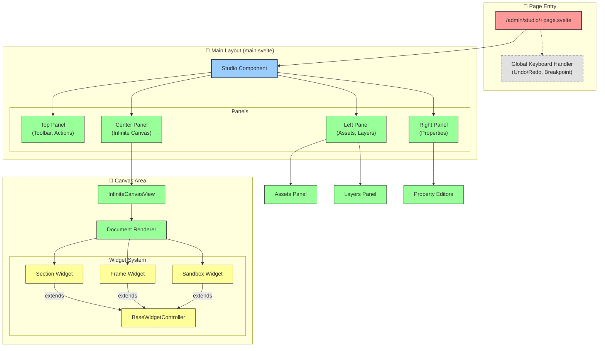

# Studio Architecture

## 1. Studio UI & Module Structure

`/admin/studio` 경로의 스튜디오 에디터 구조도입니다.



## 2. State Management Architecture

Svelte 5 Runes를 활용한 상태 관리 구조 및 데이터 흐름도입니다.

```mermaid
flowchart TD
    %% 스타일 정의
    classDef singleton fill:#ffcc99,stroke:#333,stroke-width:2px;
    classDef state fill:#99ccff,stroke:#333,stroke-width:1px;
    classDef logic fill:#ff99cc,stroke:#333,stroke-width:1px;
    classDef component fill:#99ff99,stroke:#333,stroke-width:1px;

    subgraph Global_State ["🌍 Global State (Singletons)"]
        StudioDoc["StudioDoc (Singleton)<br/>studio-doc.svelte.ts"]:::singleton
        Context["Context<br/>(Breakpoint, Panning)"]:::state
        
        subgraph Doc_Internal ["StudioDoc Internals"]
            DocState["$state(DocState)<br/>(Assets, Sections)"]:::state
            ActiveId["$state(activeId)"]:::state
            HistoryInfo["$state(historyInfo)"]:::state
        end
        
        HistoryMgr["HistoryManager<br/>(Undo/Redo Logic)"]:::logic
    end

    subgraph Widget_State ["🧩 Widget Local State"]
        BaseCtrl["BaseWidgetController"]:::logic
        ChangeTracker["ChangeTracker"]:::logic
        WidgetProps["$props() / $state()"]:::state
    end

    subgraph Components ["🖥️ UI Components"]
        CanvasView["Canvas View"]:::component
        PropPanel["Property Panel"]:::component
        LayerPanel["Layer Panel"]:::component
    end

    %% 데이터 흐름
    StudioDoc -- manages --> DocState
    StudioDoc -- manages --> ActiveId
    StudioDoc -- delegates --> HistoryMgr
    
    HistoryMgr -- updates --> DocState
    
    %% 컴포넌트 구독 및 액션
    DocState -- binds/reads --> CanvasView
    ActiveId -- reads --> PropPanel
    
    CanvasView -- calls --> BaseCtrl
    PropPanel -- updates --> StudioDoc : updateProp
    
    BaseCtrl -- tracks --> ChangeTracker
    BaseCtrl -- reads --> Context : Breakpoint
    
    %% 위젯 업데이트 사이클
    ChangeTracker -- notifies --> BaseCtrl
    BaseCtrl -- setup --> Draggable["Draggable/Resizable"]:::logic
    
    %% 키보드 액션
    Keyboard["Keyboard Events"] -- calls --> StudioDoc : "undo()/redo()"
    Keyboard -- updates --> Context : "Switch Breakpoint"
```

